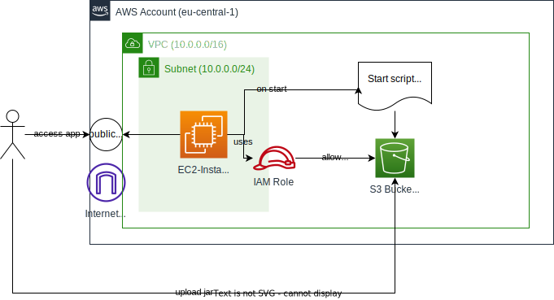

# AWS Exercises

## Exercise 1



### Goal

Run the Petclinic application in the AWS cloud.

### Tasks

- [x] Create an S3 bucket and upload your app jar
- [x] Build a VPC (AWS network) with one public subnet
- [x] Create a bootstrap script that runs on instance creation that installs java, downloads the App-Jar from S3 and runs it
- [x] Start an EC2 Instance VM in the public subnet that uses the start script
- [x] Test that you can access the app via the public IP of the EC2 Instance

### Prerequsites

- Java 17 must be installed (e.g. OpenJDK)

### Run the application locally

To view the app locally, run the following command from the project root:

```bash
# under Linux
./gradlew bootRun

# under Windows
gradlew bootRun
```

You should see an output like
```
...
2023-11-06T16:40:50.997+01:00  INFO 8015 --- [  restartedMain] o.s.s.petclinic.PetClinicApplication     : Started PetClinicApplication in 4.535 seconds (process running for 4.958)
```

You can then access the app at http://localhost:8080/. It looks something like this:


### Build the application JAR

To build the application, run

```bash
# under Linux
./gradlew build

# under Windows
gradlew build
```

You will find the application under `build/libs` named `spring-petclinic-3.1.0.jar`.

Rename the file to `app.jar`, since it is easier to remember.

### Background info

* If you are stuck, check the provided learning courses and labs on acloudguru. If you are still stuck, just ask us in Teams P2 Infrastructure.
* All tasks can be performed in the AWS Web console (see Teams on how to log in to the team accout)
* Create your first tests in the acloudguru Cloud Playground, when you have a working solution recreate it in the team account
* In the AWS team account, all resources should be created in the AWS Region eu-central-1 (Frankfurt). For acloudguru it does not matter.
* You can use the VPC Wizard to create an VPC (Service VPC, Create VPC)
* For VPC choose: Number of availability zones=1, Number of public subnets=1, Number of private subnets=0, VPC Endpoints=none, VPC CIDR=10.0.0.0/16, Subnet CIDR=10.0.0.0/24
* The S3 Bucket name must be globally unique. Use oc-buddies- as prefix.
* For the EC2 Instance please use the `Amazon Linux 2023 AMI` and Instance Type `t2.micro` (both are the default options).
* Make sure to create the EC2 instance with a public IP address (check network settings / auto-assign public IP).
* Since the app is running on port 8080, the EC2 Instance needs to have a SecurityGroup attached which allows port 8080 from 0.0.0.0/0 as inbound rule
* Also allow ssh access via port 22 to the EC2 instance, when you want to connect to it to debug it.
* To run the bootstrap script on startup use EC2 UserData: https://docs.aws.amazon.com/AWSEC2/latest/UserGuide/user-data.html
* The bootstrap script should 1) install Java (Corretto 17), 2) Download the App-Jar from your S3 bucket, 3) Run the App-Jar with java
* Use this shell command to install Java 17 on AWS Linux: `sudo dnf install java-17-amazon-corretto`
* Use `aws s3 cp s3://<bucket-name>/app.jar .` to download the jar (the last dot is important!). See also: https://docs.aws.amazon.com/cli/latest/reference/s3/cp.html
* Start the app with `java -jar app.jar`
* You can test your script in EC2 if you ssh into the EC2 instance `ssh -i <keypair>.pem ec2-user@<public-ip>`, or via EC2 Instance Connect from the Web Console.
* To check your script execution you can check the log file `/var/log/cloud-init-output.log` on the EC2 instance. Any output or execution errors from your script will be in this log file.
* The script is only executed after the first instance start, not when you stop and restart your instance. If the script has an error you will have to create a new instance. Terminate old instances to save money.
* For the EC2 instance to download the jar from S3, it needs an IAM Role with S3 Permissions
* Make sure to select the correct VPC and subnet when creating the EC2 instance, also enable Auto-assign public IP
* To access S3 you can use the aws-cli in the bootstrap script, it is already installed on the AWS AMI
* If everything works you should be able to access the app via a browser at `http://<public-ip>:8080/`
